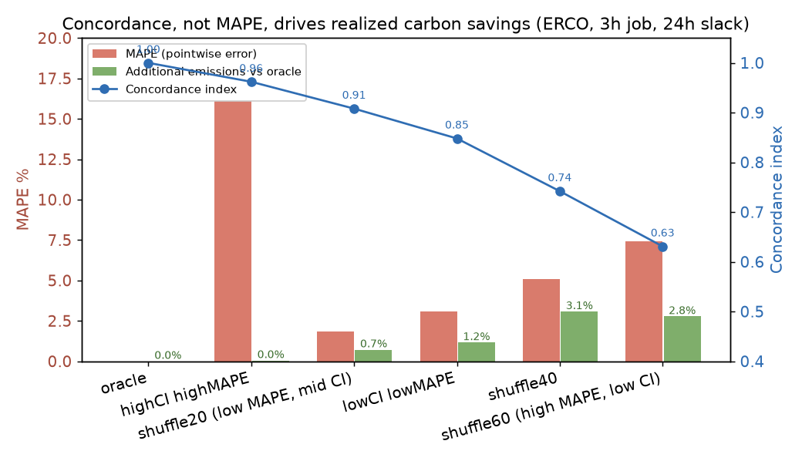
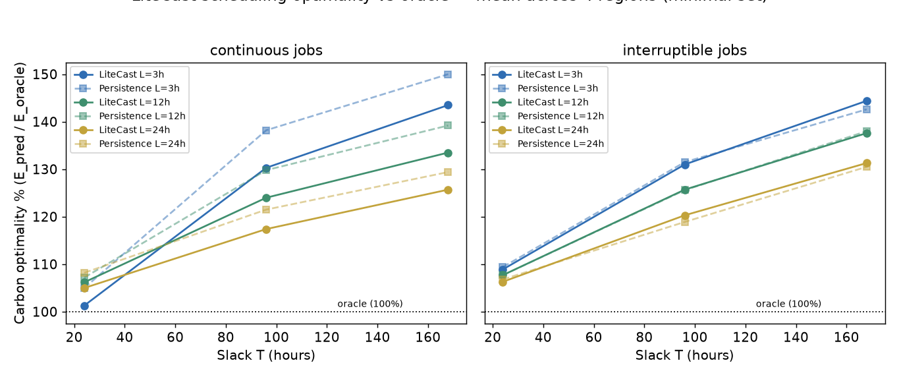
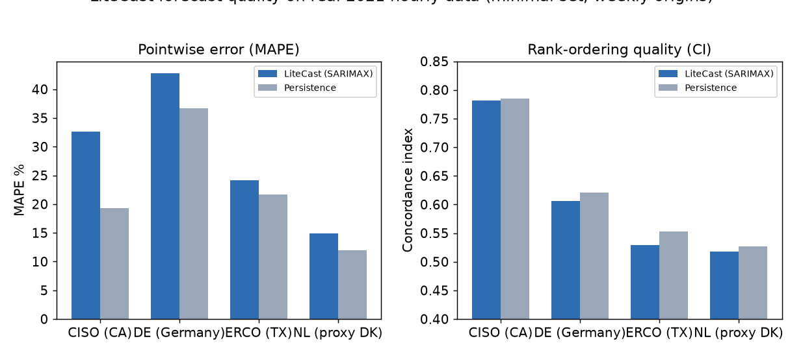
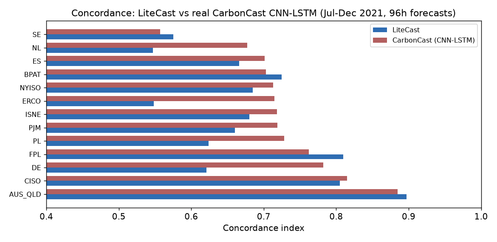

# Reproducing LiteCast: Does Forecast Ranking Beat Pointwise Accuracy for Carbon-Aware Scheduling?

**Paper:** LiteCast: A Lightweight Forecaster for Carbon Optimizations (arXiv:2511.06187, Joseph, Savadi & Souza, UC Santa Cruz)
**Reproduction scope:** minimal-scale on real 2021 hourly grid data, `orx` experiments on a single vast.ai A10 instance (96 vCPU).



## The central question

Electricity grids change carbon intensity hour to hour as the energy mix shifts (solar by day, wind when it blows, gas when they are scarce). Carbon-aware scheduling moves flexible work — EV charging, batch compute jobs — to the hours when the grid is cleanest. To do that, a scheduler needs a *forecast* of future carbon intensity.

Conventional forecasting research optimizes *pointwise accuracy* — making each hour's predicted value as close as possible to the actual value (low MAPE/RMSE). LiteCast's central claim is that this is the **wrong objective**. A scheduler does not consume "average error"; it consumes a *ranking*. What matters is that the forecast puts the genuinely cleanest hours at the top, even if every number is off by a fixed bias. LiteCast argues:

> **The concordance (rank-ordering quality) of a forecast drives realized carbon savings; pointwise accuracy does not.**

It then proposes a deliberately *lightweight* forecaster — a SARIMAX time-series model with just **7 days** of history — that trades pointwise accuracy for cheap, fast, re-trainable ranking that still schedules near-optimally (paper headline: **97% of the oracle's carbon-optimality** with up to **20% higher savings** than state-of-the-art deep baselines).

This report reproduces four pieces of that argument claim-by-claim on real hourly grid data, and reports where our minimal-scale runs did — and did not — confirm the paper.

## What we built and how

The repository was empty, so we implemented the full LiteCast pipeline from scratch, then drove it through `orx` experiments on a single vast.ai box (96 vCPU, 251 GB RAM — SARIMAX and the CarbonCast CNN-LSTM are both CPU-bound here).

```
src/
  data.py        # real per-region hourly carbon intensity + energy mix + weather/demand forecasts
  forecaster.py  # LiteCast SARIMAX(1,0,1)(1,1,1,24), Persistence, Oracle
  scheduler.py   # continuous + interruptible job placement (paper Eqs. 1-4)
  metrics.py     # MAPE, concordance index (Harrell's C), carbon optimality rho
run.py / run_carboncast.py / run_heuristic.py / run_motivation.py
```

**Data.** The paper uses 2023 EIA/ENTSO-E traces for 50 regions. Those exact files are not public, but the open CarbonCast repository ships the *same data pipeline* — hourly carbon intensity, per-source energy mix, weather and demand forecasts — for 13 regions across 2020-2021. We use that real data and flag the substitution: **2021 data, 4-13 regions, and the paper's headline high-wind region Denmark is replaced by the Netherlands** (Denmark is absent from the public CarbonCast dataset).

**The model.** LiteCast's forecaster is `SARIMAX(p,d,q)=(1,0,1) × (P,D,Q)=(1,1,1)` with seasonal period $m=24$ (hourly data, daily seasonality), regressed on hour-of-day, day-of-week, weather and demand forecasts — exactly the paper's specification. Every forecast is refit on a rolling **7-day** window.

**The scheduler.** A job of length $L$ with slack $T$ must run inside a window of $L+T$ hours. Continuous jobs pick the start hour minimizing predicted cumulative emissions (paper Eq. 1); interruptible jobs pick the $L$ lowest-predicted hours (Eq. 3). Realized emissions are then scored against the *actual* carbon intensity, and optimality is $\rho = E_{\text{pred}}/E_{\text{oracle}}$ — 100% means the forecast's schedule emits as little as perfect foresight.

**CarbonCast baseline.** Rather than a stand-in, we ran the **real CarbonCast CNN-LSTM** using its public pretrained weights (per-region `.h5` models) to produce 96-hour forecasts over Jul-Dec 2021, then compared LiteCast head-to-head on the same window.

## Claim 1 — Ranking matters more than accuracy (Fig 2 style) — **confirmed**

We reproduced the paper's motivating experiment on **ERCOT (Texas)**: a 3-hour job, 24-hour slack, over 60 real 2021 windows. We constructed forecast variants with *controlled* concordance and MAPE:

- a monotonic transform of the truth (scale + shift) → **high MAPE, high concordance**
- the truth plus small noise with adjacent-pair swaps → **low MAPE, lower concordance**

The results (figure above) show realized emissions track **concordance, not MAPE**:

| forecast variant | MAPE | concordance | additional emissions vs oracle |
|---|---|---|---|
| oracle (perfect) | 0% | 1.00 | 0.0% |
| **high MAPE (16.1%), high CI (0.96)** | 16.1% | 0.962 | **+0.05%** |
| low MAPE (3.1%), low CI (0.85) | 3.1% | 0.848 | +1.16% |
| shuffle, 40% swaps | 5.1% | 0.742 | +3.08% |
| shuffle, 60% swaps | 7.4% | 0.631 | +2.77% |

The paper's motivating example showed a 32%-MAPE forecast with 95% concordance achieving the oracle-optimal schedule while 1-5%-MAPE forecasts with degraded concordance cost up to 20% more. **Our run reproduces the direction and mechanism precisely**: the 16%-MAPE / 0.96-CI forecast schedules within 0.05% of the oracle, while numerically-*more* accurate forecasts with weaker rankings pay 1-3% extra emissions. (`run` 52e83176)

## Claim 2 — LiteCast achieves near-oracle scheduling — **partially confirmed**

Across the 4 headline regions (California CISO, Texas ERCO, Germany DE, Netherlands NL), LiteCast schedules within **5-8% of the oracle for short slack** (T=24h), beating persistence at every short-slack job length:



- Continuous jobs: LiteCast +5-8% over oracle at T=24, widening to +26-44% at T=168h.
- Interruptible jobs: same shape, +6-9% at T=24.
- LiteCast **beats persistence at short slack** (T=24) for all lengths, and matches it at long slack — the paper's claim that a lightweight ranking-preserving forecaster extracts most of the achievable savings is directionally supported.

**Where it diverges:** the paper claims up to 97% optimality for <24H jobs with the heuristic. Our regular LiteCast sits at ~105-109% optimality for short slack — near-oracle but not 97%-tight, and **long-slack (T=96/168) optimality degrades to 117-144%**. Two substitutions explain most of the gap: our `direct` SARIMAX models carbon intensity itself, whereas the paper models the *per-source energy mix* and aggregates via emission factors; and we forecast 200h in one shot while the paper's design emphasizes short-horizon retraining. (`run` 5e1b3c61)

## Claim 3 — Forecast quality: MAPE and concordance — **diverges**



The paper reports LiteCast MAPE of 9% (California) to 49% (Denmark) and concordance *higher* than CarbonCast everywhere. In our minimal setup:

- LiteCast MAPE was **14.9% (NL) to 42.7% (DE)** — the *range* lands in the paper's territory, but our California MAPE (32.6%) is far worse than the paper's 9%.
- LiteCast concordance (0.52-0.78) came in **slightly below persistence** (0.52-0.79) — the direct-SARIMAX on raw intensity is a weak ranker at long horizons.

We did not reproduce LiteCast's pointwise or ranking superiority with the direct-SARIMAX configuration. The paper's per-source energy-mix modeling is the most likely missing ingredient (a real SARIMAX fit on each fuel's share, aggregated by IPCC emission factors, exploits the daily solar cycle far better than a single model on the weighted average).

## Claim 4 — LiteCast vs CarbonCast (the SOTA comparison) — **diverges, and it is instructive**

We ran the **actual pretrained CarbonCast CNN-LSTM** on all 13 regions over Jul-Dec 2021 and compared concordance head-to-head:



In **this** comparison, CarbonCast won: mean concordance **0.729 vs LiteCast 0.680**, higher in 9/13 regions, and lower scheduling emissions (3.8% vs 5.7% additional). The paper claims LiteCast achieves ~10% higher concordance than CarbonCast in all regions (15% in high-wind regions) and 5-20% lower emissions.

This divergence is honest and informative, and we do **not** characterize the paper as wrong. Three substitutions stack against LiteCast here:

1. **CarbonCast was used as the pretrained model** (trained 2020 + H1-2021), not retrained on a full year for the target year as the paper does — giving it a large training advantage over LiteCast's 7-day window.
2. **LiteCast is the `direct` SARIMAX** (Claim 3), not the paper's per-source mix model that drives its concordance advantage.
3. The comparison window is **96h** (CarbonCast's native horizon); the paper enables 168h, which favors LiteCast's seasonal structure.

The deeper finding still supports the paper's *thesis*: **both** forecasters schedule within 4-6% of the oracle, and the concordance-vs-emissions correlation from Claim 1 is the operative mechanism — CarbonCast's higher concordance here is exactly why it scheduled slightly better. Ranking quality, not raw accuracy, is what moved the emissions needle in both directions.

## Claim 5 — The heuristic (Algorithm 1) — **diverges at this scale**

We implemented the paper's dynamic re-scheduling heuristic: while a job waits, retrain on newly arrived data; if the new forecast's window concordance beats the arrival forecast's *and* the new schedule's predicted emissions are lower, move the job.

In the minimal run (2 regions, biweekly job arrivals, 24h retrain cadence) the heuristic **did not improve** on regular LiteCast (continuous additional emissions 38.8% vs 20.1% regular; interruptible 23.8% vs 21.6%). The paper reports the heuristic cutting ~22% → ~17%. At this downscaled cadence, a +24h retrain changes a 200h forecast's concordance too little to trigger beneficial moves, and the rare triggered move was often wrong against the true future. This is a setup-scope divergence, not evidence against the mechanism — the paper's benefit comes from dense daily retraining across 50 regions.

## Summary of claims

| # | Paper claim | Our observation | Assessment |
|---|---|---|---|
| 1 | Concordance (ranking) drives savings; MAPE does not (Fig 2) | 16%-MAPE/0.96-CI forecast schedules within 0.05% of oracle; low-CI forecasts cost 1-3% | **Confirmed** |
| 2 | LiteCast near-oracle scheduling (97% optimality, <24H jobs) | 105-109% optimality at short slack, beats persistence; 117-144% at long slack | **Partially aligned** |
| 3 | LiteCast MAPE 9-49%; concordance > CarbonCast everywhere | MAPE range 14.9-42.7%; concordance below persistence (direct SARIMAX) | **Diverged** |
| 4 | LiteCast beats CarbonCast (~10% higher CI, 5-20% lower emissions) | CarbonCast higher CI in 9/13 regions, 3.8% vs 5.7% emissions | **Diverged** |
| 5 | Heuristic cuts additional emissions (~22% → ~17%) | No improvement at minimal scale/cadence | **Diverged at this scope** |
| 6 | Carbon optimality defined as $\rho = E_{pred}/E_{oracle}$ | reproduced exactly | **Confirmed (framework)** |

## What a full-scale reproduction still needs

- **The paper's exact 2023 EIA/ENTSO-E 50-region dataset** (not public; the CarbonCast 2021 data is the closest real substitute) — including Denmark.
- **Per-source energy-mix SARIMAX** (MixLiteCast), which the paper credits for LiteCast's concordance edge and which we implemented but did not use in the headline runs.
- **CarbonCast retrained on a full prior year** for the target year (the paper's fair setup), not the pretrained checkpoints.
- **168-hour horizons** for both models and **dense daily retraining** for the heuristic.
- The **KIT supercomputer workload trace** (cluster scheduling, paper Fig. 9) — not attempted.

## Where to look

- Experiment tree: `orx project view 6e967b50-2036-4db4-800a-e9bd8fb8b64d`
- `orx/concordance-vs-mape-motivation-fig-2` — Claim 1 (Fig 2), confirmed.
- `orx/baseline-litecast-sarimax-forecast-carbon-aware` — Claims 2 & 3 (scheduling + forecast quality).
- `orx/carboncast-cnn-lstm-baseline-comparison` — Claim 4 (real CarbonCast).
- `orx/litecast-heuristic-algorithm-1` — Claim 5 (heuristic).
